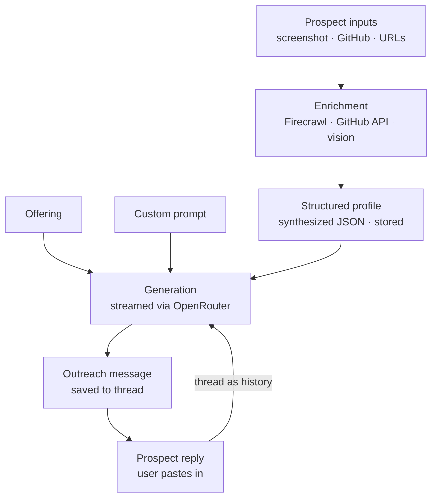

# Spec — AI Outreach Platform

A full-stack dashboard for generating hyper-personalized cold outreach, managing prospects, and handling replies — AI-powered end to end.

**Deadline:** Sunday May 31, 5:58 PM. **Scope is fixed by the deadline** — build the graded surface well, keep everything else minimal. See §11 Non-goals.

> This spec is the source of truth for the build. Plan against it. Where a decision is marked **[swappable]**, it's a sensible default you may change with reason — but be ready to defend it (the assignment requires defending every decision).

---

## 1. What's being graded (build priorities flow from this)

The reviewers will read every generated message and judge quality; working-but-generic is a fail. They will also: edit the prompt/offering and verify output changes meaningfully; throw varied URL + screenshot combinations at prospect input; paste a reply and expect natural continuation; and use the deployed app end to end.

Priority order for time and care:
1. **Message quality** — the generation pipeline and the prompts (§5).
2. **Context enrichment** — scrape + vision → a structured profile (§5.2). This is what makes multi-input graceful and messages specific.
3. **Reply continuity** — thread passed as history, not a fresh gen (§5.3).
4. **Customization that visibly moves output** — the user's prompt and offering must really steer the model.
5. **UI polish** so it reads as a product.

Auth and CRUD are commodity: correct and fast, not gold-plated.

---

## 2. Architecture overview



The pivot is the **structured profile**: enrichment writes it once per prospect; generation reads it. Generation never re-scrapes. Reply handling is the same generation call with the thread prepended as message history.

---

## 3. Tech stack (locked)

| Concern | Choice | Notes |
|---|---|---|
| Framework | Next.js (App Router) | Route Handlers for API + streaming |
| Client data | TanStack Query | useQuery/useMutation against Route Handlers |
| Language | TypeScript (strict) | |
| DB | Postgres (Neon or Railway) | |
| ORM | Drizzle | |
| Auth | Better Auth (email + password only) | No email verification, no OAuth |
| AI calls | OpenRouter | One key, model switching, vision |
| AI SDK | **Vercel AI SDK** **[swappable]** | `streamText` for streaming, `generateObject` + Zod for the profile JSON. Fallback: OpenAI SDK pointed at OpenRouter base URL, or raw fetch. No LangChain/LlamaIndex — no RAG, no agents here. |
| Scraping | Firecrawl | Returns clean markdown, handles JS |
| GitHub | GitHub REST API (`api.github.com`, unauthenticated) | Cleaner than scraping |
| LinkedIn | Vision model over uploaded screenshot | LinkedIn blocks scraping by design |
| Screenshots | **Vision-only, not persisted** **[swappable]** | Send to vision model as base64, store only extracted text in `prospect_source.rawExtracted`. Drops a file-storage dependency. Flip to object storage if image retention is wanted. |
| UI | Tailwind + shadcn/ui | |
| Streaming | Route Handler returning a streamed text response | |
| Deploy | Vercel + Neon | Deploy a skeleton on day 0 to de-risk |

**Models (verify exact OpenRouter slugs at build time — slugs drift):**
- Generation: a top writing model (e.g. `anthropic/claude-sonnet-4` or `openai/gpt-4o`); pick whichever writes the most human, least salesy copy in a quick A/B.
- Vision: `openai/gpt-4o` or `google/gemini-2.0-flash`.
- Synthesis / assists: a fast cheap model (`google/gemini-2.0-flash` or similar).

---

## 4. Data model

Better Auth owns `user`, `session`, `account`, `verification` (let it generate these). App tables below. All app rows are scoped by `userId` and every query must filter on the authenticated user.

```
offering
  id            uuid pk
  userId        fk user
  name          text
  content       text            -- synthesized, editable offering body
  sourceUrl     text null       -- if scraped
  rawScraped    text null       -- raw firecrawl markdown, kept for re-edit
  createdAt, updatedAt

prompt                          -- named system-prompt presets
  id            uuid pk
  userId        fk user
  name          text
  systemPrompt  text            -- sent (almost) verbatim as the system message
  isDefault     boolean default false
  createdAt, updatedAt

prospect
  id               uuid pk
  userId           fk user
  name             text
  profile          jsonb null   -- ProspectProfile (see §5.1); the reusable context
  enrichmentStatus text         -- 'pending' | 'enriching' | 'ready' | 'failed'
  createdAt, updatedAt

prospect_source                 -- each raw input + what we extracted from it
  id           uuid pk
  prospectId   fk prospect
  type         text             -- 'linkedin_screenshot' | 'github' | 'website' | 'company' | 'other'
  value        text null        -- URL (null for screenshot if not persisted)
  rawExtracted text null        -- scraped markdown / vision output, pre-synthesis
  createdAt

conversation                    -- one outreach thread
  id            uuid pk
  userId        fk user
  prospectId    fk prospect
  offeringId    fk offering
  promptId      fk prompt
  createdAt, updatedAt

message                         -- thread turns
  id              uuid pk
  conversationId  fk conversation
  role            text          -- 'assistant' (ours) | 'prospect' (pasted reply)
  content         text
  tone            text null     -- tone/angle used for this generation
  rating          int null      -- nullable (1-5 or thumbs)
  isFavorite      boolean default false
  createdAt
```

Indexes: `prospect.userId`, `conversation.prospectId`, `message.conversationId`.

History model: a prospect may have multiple conversations (one per offering/angle). The first `assistant` message in a conversation is the cold outreach; later turns are replies and follow-ups. Rating / favorite / delete apply to `assistant` messages.

---

## 5. AI layer (the product — this is what's graded)

### 5.1 ProspectProfile (synthesis output, stored on `prospect.profile`)

```ts
type ProspectProfile = {
  name: string
  headline: string          // "Sales Engineer @ B2B SaaS, ex-founder"
  role: string | null
  company: string | null
  location: string | null
  background: string         // 2-3 sentence synthesis
  recentSignals: string[]    // timely, datable: posts, launches, job change
  technicalProfile: string | null   // from GitHub: stack, notable repos, activity
  interests: string[]
  likelyPainPoints: string[]
  personalizationHooks: string[]    // 3-5 SPECIFIC, usable opening angles
}
```

`personalizationHooks` is the highest-leverage field — concrete, referenceable things ("posted last week about outreach volume", "maintains an open-source MCP client"). Generation leans on these. Use a Zod schema mirroring this type for `generateObject`.

### 5.2 Enrichment (runs at prospect save; write `enrichmentStatus` as it progresses)

For each source by type:
- `github` → parse username from URL → `GET api.github.com/users/{u}` + `GET /users/{u}/repos?sort=updated&per_page=10` → bio, top languages, notable/recent repos.
- `website` / `company` / `other` → Firecrawl scrape → markdown.
- `linkedin_screenshot` → vision call → extracted text.

Then concatenate all `rawExtracted` (labelled by source) → one synthesis call → `ProspectProfile` → store, set status `ready`. A single failed source must not abort enrichment — collect what's available and note gaps. Run inline in the request (or fire-and-forget with status polling); no job queue.

### 5.3 Generation & reply

Generation message array:
- **system** = the user's `systemPrompt` verbatim + a minimal output guard.
- **user (context)** = offering + structured profile + the hooks.

Reply: reuse the same system + offering/profile context, and pass the **full thread as message history** (`assistant` → `assistant`, `prospect` → `user`), then generate the next `assistant` turn. Both generation and reply stream to the client; persist the final message server-side after the stream completes.

### 5.4 Prompts (use verbatim as starting points; tune during build)

**(a) Vision extraction — LinkedIn screenshot**
```
System: You extract professional context from a LinkedIn profile screenshot.
Return concise plain text covering: name, current role and company, headline,
location, recent posts or activity visible, career background, and any signals
about what they care about or struggle with. Only state what is visible in the
image. Do not invent. If something isn't shown, omit it.
[image attached as base64]
```

**(b) Profile synthesis — raw sources → ProspectProfile JSON** (use `generateObject` + Zod)
```
System: You build a structured outreach profile from raw context about a prospect.
Rules:
- personalizationHooks must be SPECIFIC and timely — things a human could
  reference in a first line that prove "I actually looked you up." No generic
  filler like "passionate about technology."
- recentSignals are datable/recent events only.
- If a field is unknown, use null or an empty array. Never fabricate.

User: Here is everything gathered about the prospect, labelled by source:
<labelled raw extracted text>
```

**(c) Generation — outreach message**
```
System:
<user's systemPrompt verbatim>

---
Output ONLY the message text the user will send. No subject line, no label
scaffolding, no explanation, no surrounding quotes.
```
```
User (context):
OFFERING (the value I bring):
<offering.content>

PROSPECT:
<readable rendering of ProspectProfile>

Most relevant angles: <profile.personalizationHooks joined>

[If regenerating with a tone/angle override:]
For this version, write it: <tone/angle, e.g. "more direct, lead with the pain point">
```

**(d) Reply — natural continuation**
```
System: <same systemPrompt verbatim>
---
Continue this outreach conversation naturally. Stay in the same voice and length
as the earlier messages. Address what they actually said. Output ONLY your next reply.

OFFERING: <offering.content>
PROSPECT: <readable rendering of ProspectProfile>

messages: [ <full thread, assistant->assistant, prospect->user> ]
```

**(e) Inline assists**
- Offering from scrape: "Turn this scraped page into a crisp offering: what they do, who they sell to, the problem solved, what's different, proof points. Two short paragraphs."
- "Improve my prompt" / "Improve my offering": one cheap call rewriting the user's draft to be sharper.
- Static explainer copy for the offering and prompt empty states (use the assignment's own wording).

---

## 6. API contracts (Route Handlers, called via TanStack Query)

All handlers: resolve Better Auth session; 401 if absent; scope every query by `userId`; no cross-user row reachable.

```
/api/auth/[...all]                         Better Auth

GET    /api/offerings                       -> Offering[]
POST   /api/offerings                       { name, content, sourceUrl? } -> Offering
POST   /api/offerings/scrape                { url } -> { scraped, suggestedContent }
GET    /api/offerings/[id]                  -> Offering
PATCH  /api/offerings/[id]                  { name?, content? } -> Offering
DELETE /api/offerings/[id]                  -> { ok }

GET/POST/PATCH/DELETE /api/prompts[/id]     incl. setDefault; mirror offerings shape

GET    /api/prospects                       -> Prospect[] (with enrichmentStatus)
POST   /api/prospects                       { name, sources: {type, value?}[], screenshots? }
                                            -> Prospect (kicks off enrichment)
GET    /api/prospects/[id]                  -> Prospect + sources + conversations
PATCH  /api/prospects/[id]                  { name?, profile? } -> Prospect (manual profile edit)
DELETE /api/prospects/[id]                  -> { ok }
POST   /api/prospects/[id]/reenrich         -> Prospect (optional)

POST   /api/generate                        { prospectId, offeringId, promptId, tone? }
                                            -> STREAM; creates conversation + first assistant message
POST   /api/conversations/[id]/reply        { replyText } -> STREAM; appends prospect msg + new assistant msg
GET    /api/conversations/[id]              -> Conversation + messages
PATCH  /api/messages/[id]                   { rating?, isFavorite? } -> Message
DELETE /api/messages/[id]                   -> { ok }

GET    /api/analytics                       -> { totalMessages, offeringUsage[], prospectCount, conversationsWithReplies }
POST   /api/assist                          { kind: 'prompt'|'offering', text } -> { improved }
```

---

## 7. Pages (App Router)

```
(auth)/sign-in, sign-up
(app)/
  layout.tsx          sidebar nav + session guard
  dashboard/          analytics (§9)
  offerings/          list + create/edit; "scrape URL" + AI improve + explainer
  prompts/            list + edit; explainer + AI improve; set default
  prospects/
    page.tsx          list with enrichment status badges
    [id]/page.tsx     editable profile + sources + conversations + generate panel
```

UX that reads as product thinking: generate flow streams the message into the thread with copy / rate / favorite / regenerate controls; regenerate offers tone/angle chips (Direct / Warm / Lead with pain point / Shorter) with no re-entry; the structured profile is shown and editable on the prospect page; empty states carry the explainer copy.

---

## 8. Feature requirements + acceptance criteria

**1. Auth.** Sign up / sign in (email + password). Every offering, prompt, prospect, conversation, message is user-scoped.
- AC: a second user never sees or can fetch the first user's rows.

**2. Offering setup.** Paste a URL → scrape → editable content; or type manually; or scrape then edit. Multiple offerings; pick one at generate time. AI "improve" + explainer.
- AC: scraping kakiyo.com produces a usable offering; the same offering is editable afterward; switching offering changes generated output.

**3. Prompt customization.** Named presets, fully editable, one default. Sent (almost) verbatim as the system message. Explainer + AI assist.
- AC: editing the prompt (e.g. "under 100 words, soft CTA" → "long and formal") visibly changes the next generated message.

**4. Prospect management.** Save once, reuse across offerings. Flexible inputs: LinkedIn screenshot, GitHub URL, website, company, other URL, freeform text — any combination, no fixed format. Enrichment → structured profile.
- AC: a prospect with only a GitHub URL still enriches; a prospect with screenshot + 2 URLs produces a coherent profile; one bad URL doesn't fail the whole enrichment.

**5. Message generation.** offering + prompt + profile → streamed message; saved to history. Rate, favorite, one-click copy, delete, regenerate with tone/angle (no re-entry).
- AC: generated message references something specific to the prospect (a hook), not generic filler; regenerate with a different tone produces a meaningfully different message for the same prospect.

**6. Reply handling.** Paste a reply → contextual continuation using the full thread; thread always visible.
- AC: the follow-up addresses the actual content of the pasted reply and keeps the original tone; it reads as continuation, not a restart.

**7. Analytics.** See §9.
- AC: numbers match the database; "conversations with replies" only counts threads that have a `prospect` message.

---

## 9. Analytics

Single `/api/analytics`, all user-scoped:
- Total messages generated = count(messages where role = 'assistant').
- Offerings used most = count(conversations) grouped by offeringId, joined to offering name.
- Prospects saved = count(prospects).
- Conversations with replies = count(distinct conversationId having a message with role = 'prospect').

Render: 4 stat cards + one small bar chart for offering usage. No more.

---

## 10. Build phases (anchor the plan to these)

- **P0 (Fri eve):** scaffold Next.js + TS strict + Tailwind + shadcn; Drizzle + Neon; Better Auth; OpenRouter + Firecrawl smoke tests; **deploy skeleton to Vercel.**
- **P1 (Sat AM):** schema + offerings/prompts/prospects CRUD via Route Handlers + TanStack Query + basic UI.
- **P2 (Sat midday):** enrichment pipeline (Firecrawl, GitHub API, vision, synthesis → stored profile); profile shown + editable. Tune synthesis until hooks are specific.
- **P3 (Sat PM):** generation + streaming + history controls; A/B models and tune the generation prompt against the Sarah/Kakiyo example until quality matches or beats it.
- **P4 (Sun AM):** reply handling + thread UI.
- **P5 (Sun midday):** analytics + UI polish (empty/loading/streaming states, mobile sanity).
- **P6 (Sun PM):** final deploy + end-to-end smoke test as a fresh user; README; capture 3-4 real input→output examples; record video.

If time slips, cut from P5 first. Never cut from P2–P4.

---

## 11. Non-goals (do NOT build)

Email verification, password reset, OAuth, teams/orgs; background job queue; multi-screenshot stitching or heavy OCR cleanup; real-time collab or websockets beyond the generation stream; charting libraries beyond one bar; caching, rate limiting, retries beyond a single retry on AI calls; screenshot persistence (vision-only by default). List these under "what I'd do with more time" in the README.

---

## 12. Environment variables

```
DATABASE_URL=
BETTER_AUTH_SECRET=
BETTER_AUTH_URL=
OPENROUTER_API_KEY=
FIRECRAWL_API_KEY=
NEXT_PUBLIC_APP_URL=
# GITHUB_TOKEN= (optional, only if hitting the unauthenticated rate limit)
```

---

## 13. Deliverables

- Public GitHub repo with README: local run, project structure + architecture decisions, env vars, tradeoffs + why, what you'd do with more time, and **3-4 real input→output examples** showing range (different prompt/offering → visibly different output).
- Live deployed link that works on a fresh sign-up, end to end.
- Video walkthrough: sign in → offering via URL scrape → customize prompt → save a multi-input prospect → generate → handle a reply → analytics, narrating decisions.

---

## 14. Decisions to be ready to defend

Structured profile over raw-text-in-prompt (specificity, cheap regeneration, transparency); vision for LinkedIn but scrape for the rest (LinkedIn blocks scraping); GitHub API over scraping (clean data, free); user prompt as the literal system prompt (customization must steer the model); thread-as-history for replies (continuation, not regeneration); no LLM framework (no RAG/agents to justify one); Next.js + TanStack Query over TanStack Start (execution speed on the graded surface over framework novelty); screenshots not persisted (one less dependency for no grading benefit).
